# Container Migration Project from VM(EC2) to Containers 

**Before you start, install Docker Engine on your machine.**

## TASK 1: Migrate the Tooling Web Application from VM-based solution to a containerized one

### Containerize MySQL

1. Pull MySQL latest image from [here](https://hub.docker.com/_/mysql)
    `docker pull mysql/mysql-server:latest`

2. View the list of images  `docker images`

    *Comments: the list from `docker images ls` was empty, so I used `docker images` instead*

    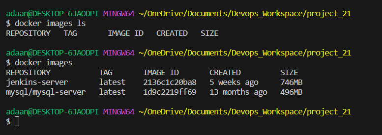

3. Run MySQL container and connect:

    - First method:  
        - make the necessary adjustments to the code
            `docker run --name <container_name> -e MYSQL_ROOT_PASSWORD=<my-secret-pw> -d mysql/mysql-server:latest`
        - Then connect with `docker exec -it <container_name> mysql -uroot -p`


    - Second method :
        -  Create a network for the MySQL and Tooling app container so they can connect:
    `docker network create --subnet=172.18.0.0/24 tooling_app_network ` - where tooling_app_network is the name of the network

            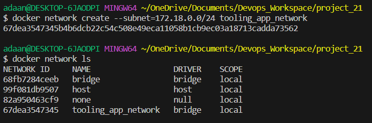

        - Store MySQL root password in a variable `export MYSQL_PW=<root-secret-password>`
        - Run MySQL container `docker run --network tooling_app_network -h mysqlserverhost --name=mysql-server -e MYSQL_ROOT_PASSWORD=$MYSQL_PW  -d mysql/mysql-server:latest `

4. Check that the container is running with `docker ps -a`
    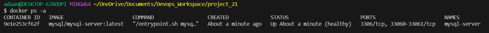 

5. Create a MySQL user for remote connection using this SQL script:

    ```
    # create_user.sql
    CREATE USER '<user>'@'%' IDENTIFIED BY '<client-secret-password>';
    GRANT ALL PRIVILEGES ON * . * TO '<user>'@'%';
    ```
6. Run the script `docker exec -i mysql-server mysql -uroot -p$MYSQL_PW < ./create_user.sql`

     


### Prepare database schema

1. Run MySQL client container inside the same network as the MySQL server container 
    `docker run --network tooling_app_network --name mysql-client -it --rm mysql mysql -h mysqlserverhost -u <user-created-from-the-SQL-script> -p`

2. Prepare a database schema so that the Tooling app and database can connect:

    - The SQL file for the schema is [here](https://github.com/dareyio/tooling) - clone this repository and store it on your machine
   `git clone https://github.com/darey-devops/tooling.git`

   - Export the location of the sql script for the schema`export tooling_db_schema=~/tooling/html/tooling_db_schema.sql`

        *Comments: docker did not find the SQL file as the tooling was saved inside another folder, so I changed the location for the file `export tooling_db_schema=~/OneDrive/Documents/Devops_Workspace/project_21/tooling/html/tooling_db_schema.sql`*
            

    - Run the sql script inside MySQL server container - this will create the database and prepare the schema
    `docker exec -i mysql-server mysql -uroot -p$MYSQL_PW < $tooling_db_schema`

    - Update `db_conn.php` with connection details to the database
    
        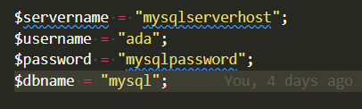

### Run Tooling App

1. Build an image from the Dockerfile inside the Tooling repo with `docker build -t tooling:0.0.1 .` - make sure you are inside the Dockerfile root folder when you do this

2. Run Tooling App container `docker run --network tooling_app_network -p 8085:80 -it tooling:0.0.1`

    Apache, the web server within the container, defaults to listening on port 80. To verify, check the CMD ["start-apache"] section in the Dockerfile. However, as port 80 on the host machine is occupied, an alternative port, such as 8085, is utilized and mapped to port 80 in the container.

    *Comments: This was the output after running the container* 

    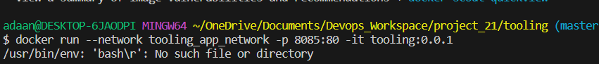

    *On Docker Desktop, the container was present but had exited. The problem seemed to stem from the start-apache script, which may not have been formatted correctly for bash. This issue was discussed in detail in the following thread: https://stackoverflow.com/questions/29045140/env-bash-r-no-such-file-or-directory/29045187#29045187*

    *Therefore, I changed the script format using `dos2unix start-apache `*

4. Access Tooling application from your browser - you will see this

    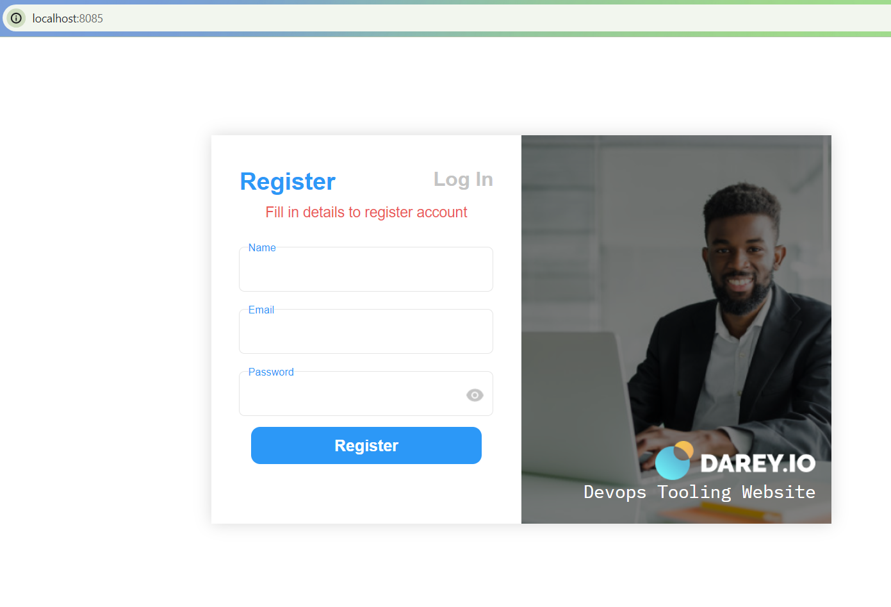

    The default email and password are 'test@gmail.com' and '12345'


## TASK 2: Migrate the Todo Web Application from VM-based solution to a containerized one

### Containerize TODO App

1. Download php-todo repo from [here](https://github.com/dareyio/php-todo)

2. Create a network so that the database and app can communicate and run MySQL container inside the network

    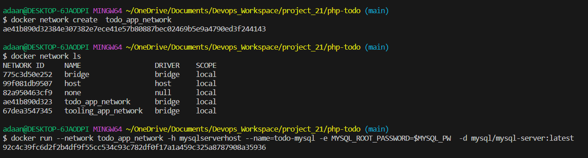

3. Create a new user for MySQL and grant privileges

    ```
    CREATE USER 'ada'@'%' IDENTIFIED BY 'mysqlpassword';
    GRANT ALL PRIVILEGES ON * . * TO 'ada'@'%';
    ```

4. You previously exported the location of the SQL script file for database schema `export tooling_db_schema=~/OneDrive/Documents/Devops_Workspace/project_21/tooling/html/tooling_db_schema.sql`
            

    - Run the sql script inside MySQL server container - this will create the database and prepare the schema
    `docker exec -i todo-mysql mysql -uroot -p$MYSQL_PW < $tooling_db_schema`

4. Change the name of the `.env.sample` file to `.env`, and update the file with your database credentials - for DB_HOST use the name or port of the container running MySQL

    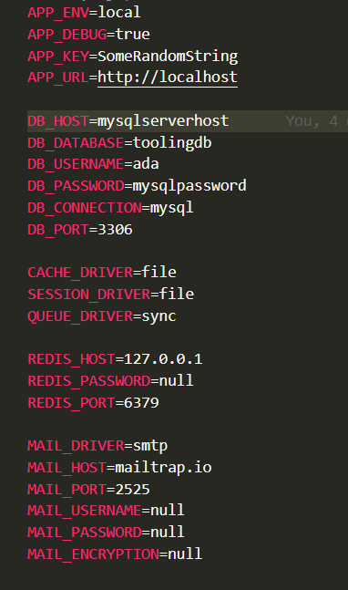

5. Write a Dockerfile for the Todo app

    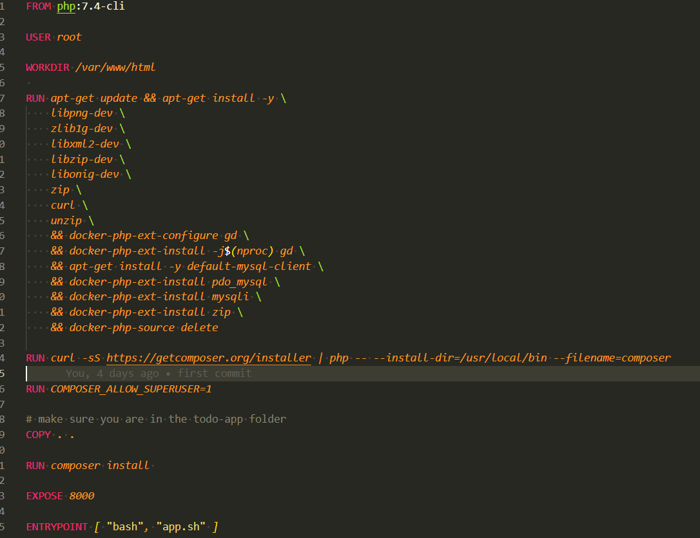

6. Build the image and run todo app container

    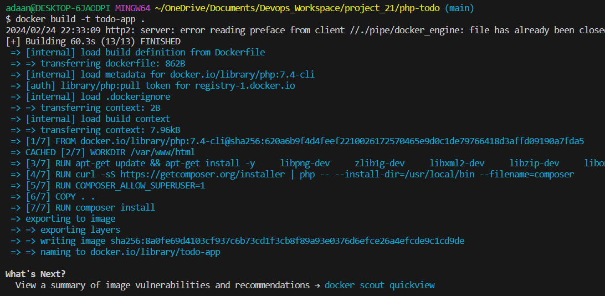

    `docker run --name todoappcontainer -p 8080:8080 --network todo_app_network -d todo-app`

7. Verify that you can connect to MySQL server from the todo app container with the user you created

    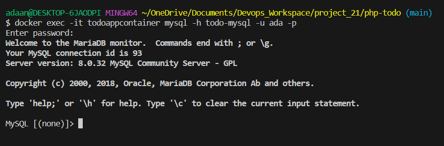

8. Access the application from your browser - try to add and delete tasks to check that everything works fine.

    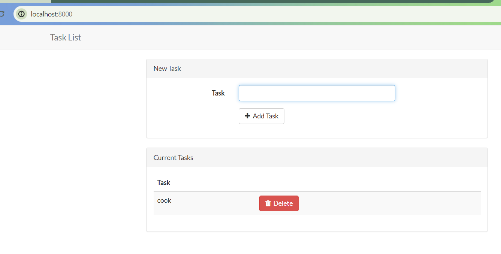


    *Comments: I encountered this error initially because I forgot to run the script for the databse schema*

    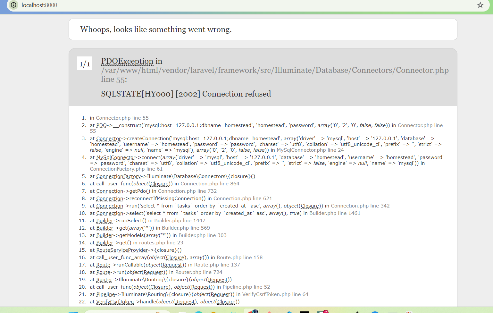


### Image Push to Docker Hub

1. Create a DockerHub account

2. Create a new docker repository

3. Create access token (go to security section under 'My account') - make sure to copy it 

4. Login to DockerHub from your terminal `docker login -u adaane` and use the access token you created as password

5. Tag and push your image to the new repo

    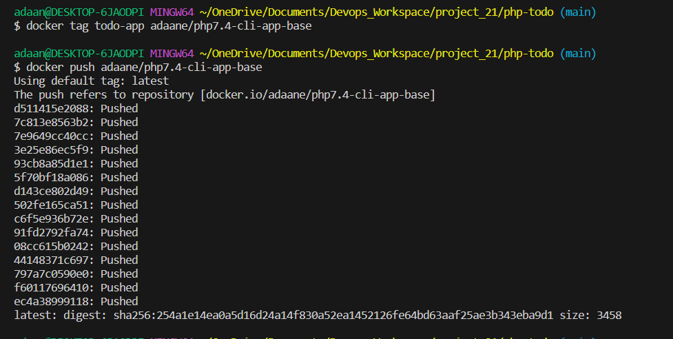

    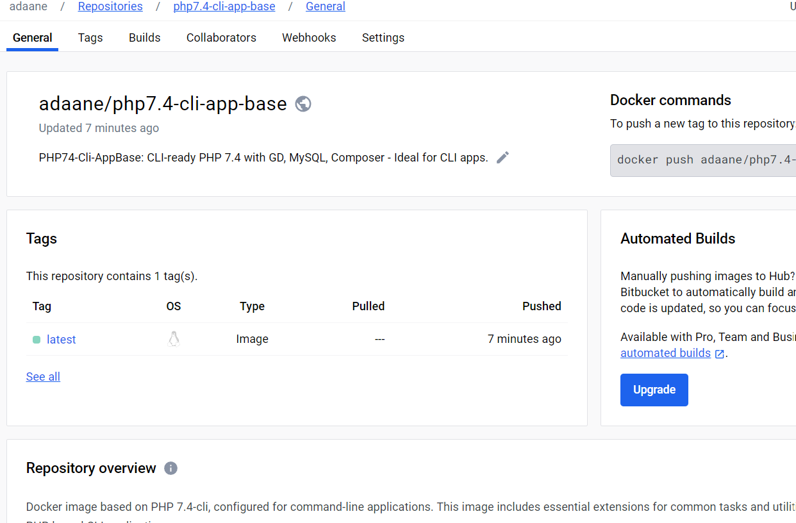

