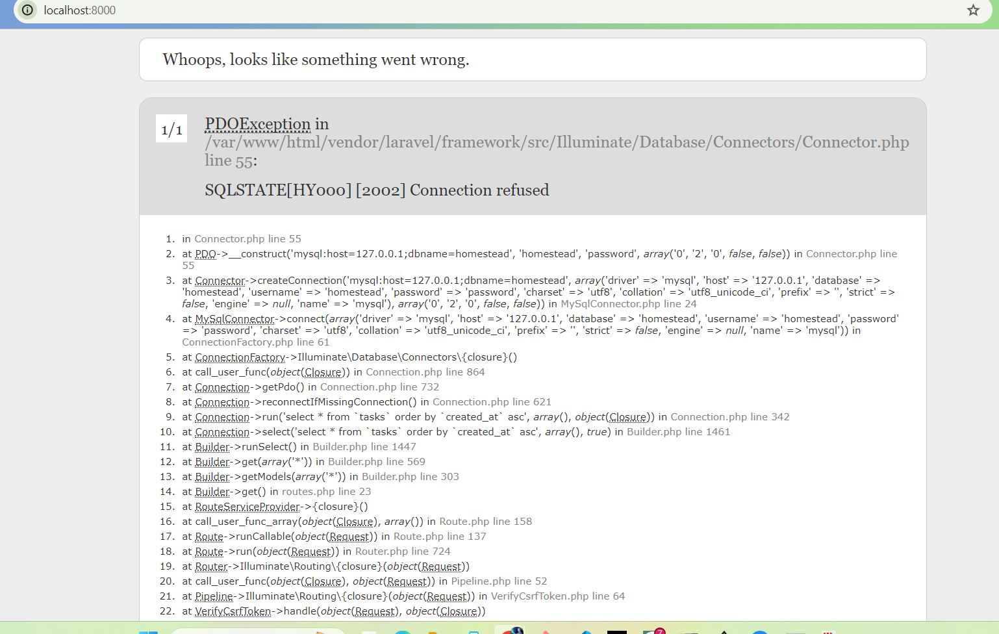

1. `docker images ls` didn't show anything so I used `docker images`

    

2. running `docker exec -i mysql-server mysql -uroot -p$MYSQL_PW < ./create_user.sql` 

    

    it doesnt give a confirmation that the user has been created successfully but I confirmed this by loggin into mysql and checking the list of users


3. if I used `export tooling_db_schema=~/tooling/html/tooling_db_schema.sql` docker wouldnt find the file as I had is saved into a dedicated forlder for this project, the command was modified to

    `export tooling_db_schema=~/OneDrive/Documents/Devops_Workspace/project_21/tooling/html/tooling_db_schema.sql`

    4. This is the output after running the command below, I checked in Docker Desktop and a container was created with the tooling:0.01 image but it wouldn't start

        

        I think the issue was with the *start-apache* script which was not in teh format that bash can understand as discussed in this thread: https://stackoverflow.com/questions/29045140/env-bash-r-no-such-file-or-directory/29045187#29045187

        I changed the script format using `dos2unix start-apache `

<!-- ### DESIGNING A DOCKERFILE FOR THE TODO APP (not to include in documentation just for learning)

I encountered different issues with this task

1. I chose to use a prebuilt image of Ngnix so I could access my app on the browser. This was my initial Dockerfile

    

    1. Error1

        

        I Did not include the location of the app files. Changed COPY src /var/www/html to COPY . /var/www/html because my application files are in the same directory as the Dockerfile. 

    2. Error2

        

        I spelled the nginx.conf file wrong so Docker could not find it. After amending it I noticed that the icon next to teh file name changed

        

        

    3. Error-3

        

        - The error "E: Package 'php7.4-fpm' has no installation candidate" suggests that the php7.4-fpm package is not available in the repositories accessible to your system's package manager.

        In the Dockerfile, I was using the nginx:latest base image, which is based on Debian. However, Debian-based images might use a different naming convention for PHP packages.

        In Debian-based images, you can use the php-fpm package without specifying the version.

        - the other errors were suggesting difficulty in locating the packages, as I did not specify the && after teh backslashes

    4. Error-4

        this was my Dockerfile following teh chnages I made after having the errors mentioned earlier 

        ````
        FROM nginx:latest

        WORKDIR /app

        RUN apt-get update \
            && apt-get install -y php-fpm \
            && docker-php-ext-install mysqli \
            && git clone https://github.com/dareyio/php-todo.git

        # Copy Nginx server block configuration
        COPY nginx.conf /etc/nginx/conf.d/default.conf

        # Copy your PHP application code
        COPY . /var/www/html

        # Expose port 80
        EXPOSE 3000

        # Start Nginx and PHP-FPM
        CMD ["nginx", "-g", "daemon off;"]
        ````

        But I had this issue:

        

        "It appears that the command docker-php-ext-install is not found, which indicates that the PHP extension installation tool is not available in your current environment. This tool is typically included in official PHP images.

        To resolve this, you can use the docker-php-ext-install command inside a PHP-based image. Consider changing your base image to one that includes PHP and provides the necessary tools. "

        So I made changes to my Dockerfile to use a php based image instead of Nginx image, and added commands to install Ngnix

        

    5. Error-5

        

        The git command was not in the system so I had to include a command to install it

        I added the `RUN apt-get install git -y` to my Dockerfile

         -->


## TODO APP CONTAINERIZATION

1. create a network so that the database and app can communicate
2. create and .env file with your environmental variables (look at the database.php file inside config folder). for DB_HOST use the name or port of the container running MySQL 


- encountered error while trying to access the todo app

    

    this errror was due to not running the tooling schema in mysql and not configuring the .env to properly (verify with testing)

## DOCKERHUB

- after creating a new image repository I created an access token in DockerHub for login (go to security section under 'My account')
- used `docker login -u adaane` to log into the Docker Hub from command line
- used the token as password
- tagged the todo-app image
-pushed the image

#### for webhooksjenkins server

Webhook needs a public ip address, so first create a network in docker and assign it a public subnet, then run the container with a public ip within that subnet and forward port 8080 on your local machine to port 8080 on the container, which is where jenkins is running.
`docker network create --subnet=171.20.0.0/24 jenkins`
`docker run -p 8080:8080 --net jenkins --ip 171.20.0.10 --name test-jenkins jenkins/jenkins`